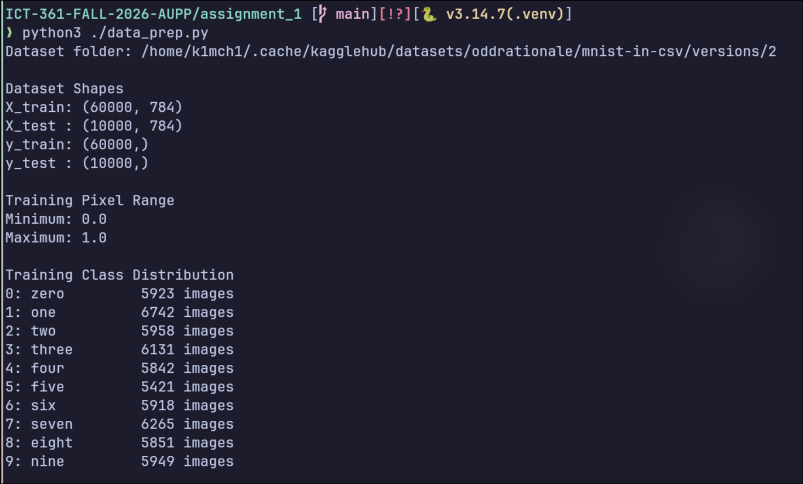
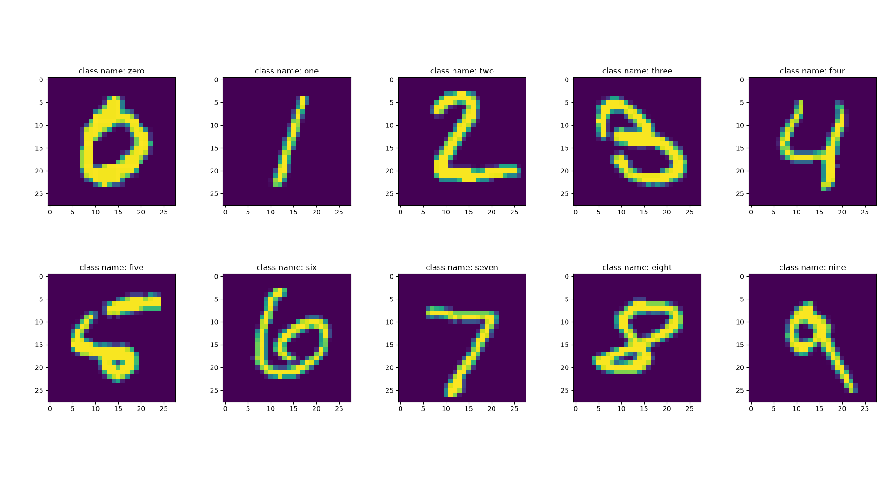
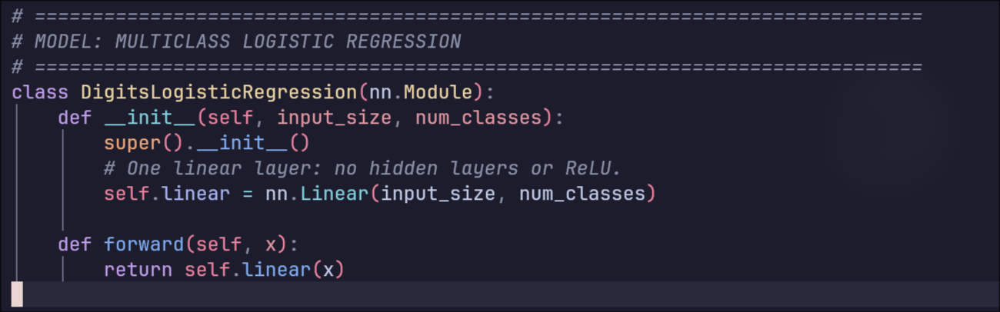
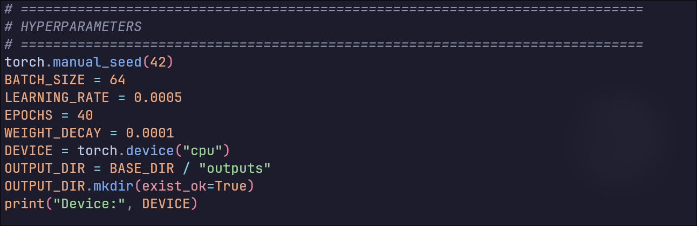
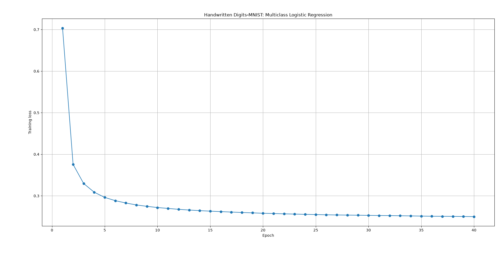
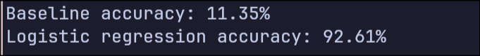
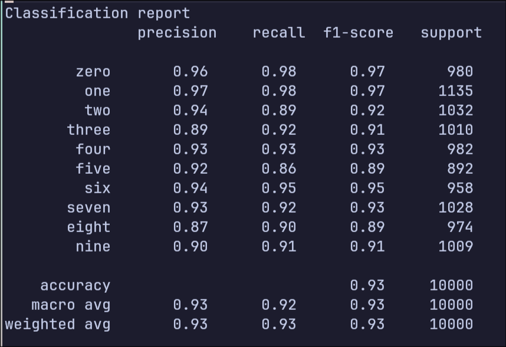
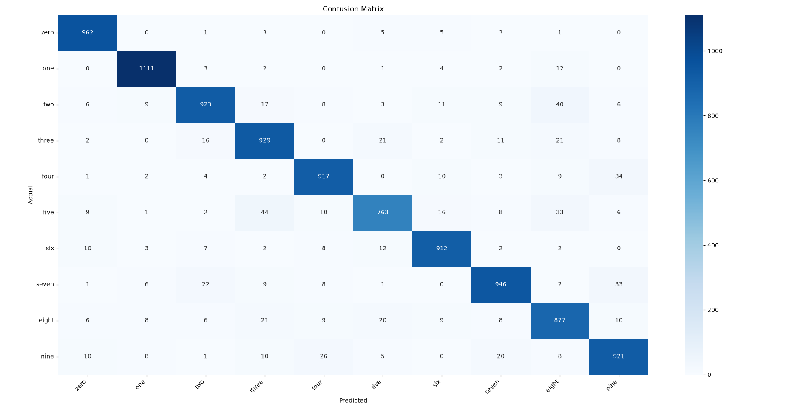
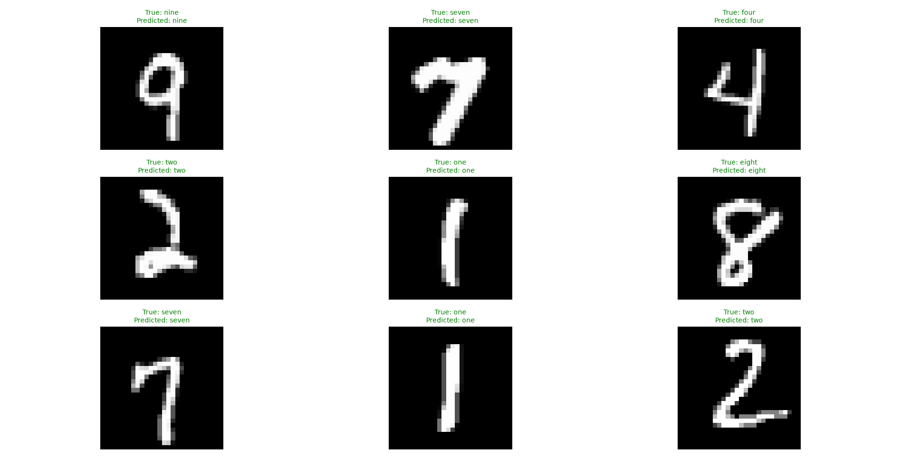
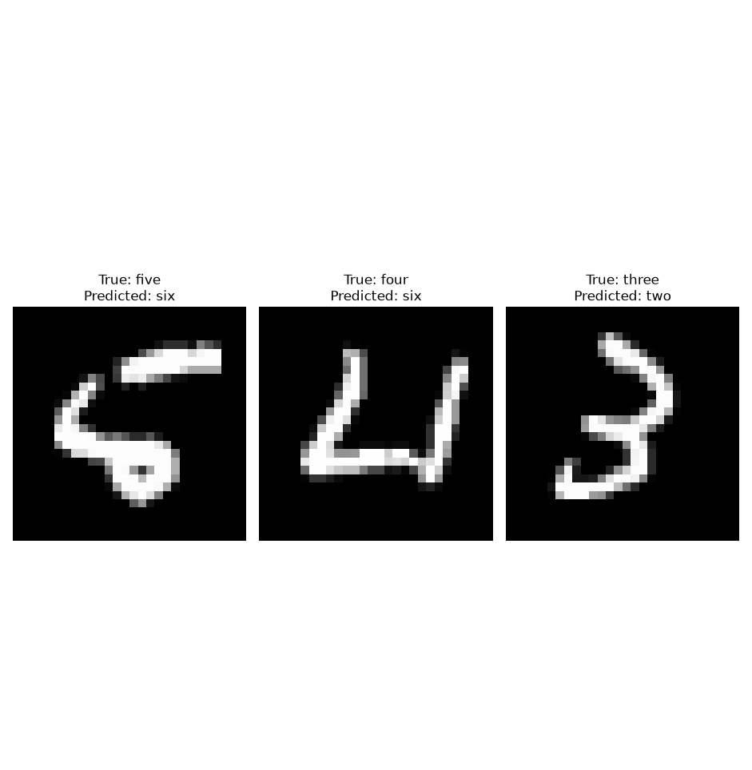

# Answers

## Dataset and preprocessing

1. There are $60000$ training images and $10000$ testing images for the MNIST hand digits dataset
2. The image is a $28 \times 28$ image, which is represented as a 1D array of size $28 \times 28 = 784$. The class labels in this case was defined as such:

```
0: zero         5923 images
1: one          6742 images
2: two          5958 images
3: three        6131 images
4: four         5842 images
5: five         5421 images
6: six          5918 images
7: seven        6265 images
8: eight        5851 images
9: nine         5949 images
```

3. We take a $28 \times 28$ matrix 2D array representation of an image and flatten it to an array of length $784$ because, we treat each pixel as a feature, and it is usually the case that most machine learning models accepts a vector of features as the input, rather than something like a 2D array or a matrix.

4. We divide the pixel values by $255$ in order to normalize it to a value in between $0$ and $1$ because it's a more natural representation that doesn't change based on the color bit depth.

5. The training data and test data must be separate because we shouldn't train on the test data, as you wouldn't be able to determine whether your machine learning model has generalized to data that it hasn't seen.





## Model and Training

1. The model uses $784$ inputs because, we treat each pixel as a feature, and since we have a $28 \times 28$ image, we have $28 \times 28 = 784$ pixels meaning $784$ features. We have $10$ outputs because we have 10 different classes of labels, that is, we want our model to categorize our input into 10 categories, that is, the digits 0 to 9.

2. We use `CrossEntropyLoss` as opposed to sum of squared error because it tends to perform better for classification problems.

3. The batch size, learning rate and number of epoch were defined as follows:

```
BATCH_SIZE = 64
LEARNING_RATE = 0.0005
EPOCHS = 40
```

4. The loss decreased until it reached an asymptote, which means that the error between the predicted data and the actual labels were getting smaller and smaller. 


The model consists of one layer of linear mapping the input of sized $784$ to size $10$.



The training settings were defined as such:



The loss graph produced is decreasing, meaning that the predicted data is getting closer and closer to the labels.



## Evalulation and predictions

1. The model achieved an accuracy of `92.61%`.
2. The most frequent class baseline has an accuracy of `11.35%`, meaning the model accuracy achieved an accuracy a lot higher than the most frequent class
3. Zero and one had the highest recall with a value of `0.98`, while five had the lowest recall with a value of `0.86`
4. From the confusion matrix, it seems that five and three are the most commonly confused, and two and eight is the second most commonly confused.
5. The incorrect predictions happen probably because the handwritten digits were quite unclear, or sometimes ambiguous
6. A high test accuracy might not guarantee correct predictions on camera images because of a difference in lighting (which requires additional processing), difference in line thickness, and additional processing of digits in order to make it $28 \times 28$ in dimensions.









Some of the incorrect results are shown as follows:



The first one can be explained by the fact that writing is ambiguous. The second data doesn't look like a conventional four, as such, perhaps incorrectly interpret it as a six. The reason why it got the third data wrong can't really be explained.

# Links for assignment details

- [assignment 1](https://theara-seng.github.io/Slides/robotics/assignment/assignment1/)
- [assignment details](https://theara-seng.github.io/Fashion-MNIST-logistic-regression/)
