# TODO

- [x] check servo library working
- [x] make good use of the servo angle atomic variable
- [x] check ultrasonic library working
- [x] double check the pin definitions
- [x] write the Dabble polling task (because Dabble exposes a polling API)
~~- [x] write the servo control task (notification model)~~ (simple pure function with side effects now, the manual mode is the one who keeps track of the current angle)
- [x] write the ultrasonic sensor task (queue based model, which notifies the automatic mode)
- [x] think about how to wrap up stop the motors when switching from manual -> auto, etc.
- [x] write the dabble RC task
- [x] check for side effects to lab 1 because we're going to define a new `detectEdge` function in the utils

# Tasks

We will use the following task from the previous labs:

- logging task which has more information [here](../docs/logging)
- mixer task which has more information [here](../docs/logging.md)

We now need the following tasks:

- `dabbleRCTask` which is responsible for polling the Dabble's API at a fixed frequency
- `dabbleOrchestrator` decides which mode should run based on results from the `dabbleRCTask`, namely, it checks whether the SELECT or START button has been pressed and changes the mode. `dabbleOrchestrator` is also responsible for notifying the `dabbleManualTask`
- `dabbleManualTask` checks that when the robot is in MANUAL mode, it will check whether certain buttons is pressed or has been pressed in order to do certain actions such as moving the robot, or moving the servo of the robot
- `ultrasonicTask` polls the ultrasonic sensor at a fixed frequency and writes it to a queue
- `dabbleAutoTask` runs everytime the ultrasonic queue has a new item, it takes that item and uses it to step through a state machine given that it's in AUTO mode

## `dabbleRCTask`

This task simply polls the dabble API for certain buttons and then stores it in an external variable that's wrapped in a mutex that can be accessed by other tasks.



## `dabbleOrchestratorTask`

This task is responsible for managing manual and auto mode



## `dabbleManualModeTask`

This task is responsible for reading the buttons from Dabble and then controlling the motors and servos accordingly while it's in manual mode.



## `ultrasonicTask`

This task is responsible for polling the ultrasonic sensor at a fixed period and push it to a queue for other tasks to access.



## `dabbleAutoModeTask`

This task is responsible for reading the ultrasonic sensor data and performing basic obstacle avoidance



The obstacle avoidance logic is a simple state machine with 2 states:

- travelling: the robot just moves forward because there is no obstacle
- searching: the robot searches for somewhere to move forward to because there is an obstacle

Our we have one transitioning conditional:

- haveObstacleInFront: defined to be `currentDistance < thresholdDistance` where `thresholdDistance` is the distance where we say that the robot should stop moving forward and search for a direction with more room to move towards

The state diagram is as follows:


We also cause side effects upon transitions as such:

- !obstacleInFront: externally write to mixer to move forward
- obstacleInFront: externally write to mixer to turn left

# Start up dependencies

So, right now, we have some weird dependencies going on.

- `dabbleRCTask` requires `dabbleOrchestrator` because it needs to notify it
- `dabbleOrchestrator` receives notification from `dabbleRC` and then starts doing its thing (so this should be started first)

- `dabbleAutoMode` waits for the `dabbleOrchestrator` to initialize the modes mutex, so it should be started higher up.
- `dabbleManualMode` waits for `dabbleOrchestrator` to notify it, but it needs to be initialized immediately so that `dabbleOrchestrator` can call it

So essentially, we start up in this order:

1. `dabbleManualMode`: because it just starts up and halts until someone notifies it, meaning that it will create a task handle, and then wait until `dabbleOrchestrator` notifies it which would have guaranteed that `dabbleOrchestrator` initialized its modes variables and stuff
2. `dabbleOrchestrator`: we need this now because we need to initialize the modes that the auto-mode needs
4. `dabbleRCTask`: can now call `dabbleOrchestrator` by its handle
3. `dabbleAutoMode`: `dabbleOrchestrator` has already initialized the modes mutex so it is fine

# Pre-requisites

We are going to use the Dabble mobile app, along side with their decoder, which can be installed as such:

```
arduino-cli lib install "DabbleESP32"
```
